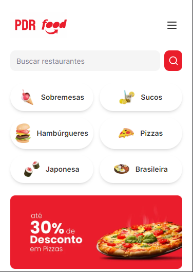

<h1 align="center"> PDR-Food [EM ANDAMENTO] </h1>

<p align="center">
Este projeto foi feito durante fullstack week do Felipe Rocha. <br/>
</p>

<p align="center">
  <a href="#-tecnologias">Tecnologias</a>&nbsp;&nbsp;&nbsp;|&nbsp;&nbsp;&nbsp;
  <a href="#-projeto">Projeto</a>&nbsp;&nbsp;&nbsp;|&nbsp;&nbsp;&nbsp;
  <a href="#-layout">Layout</a>
</p>

<br>

<p align="center">
  
</p>

## 🚀 Tecnologias

Esse projeto foi desenvolvido com as seguintes tecnologias:

- Next 14
- TypeScript
- Tailwindcss
- Git e Github
- Shadcn UI
- Prisma
- Postgresql
- Next-auth
---


## 💻 Projeto

O “PDR-Food" é um sistema de entrega de comida que conecta restaurantes e clientes, permitindo que as pessoas façam pedidos de comida online e recebam suas refeições em casa.

<!-- - [Acesse o projeto finalizado, online](https://) -->
---

## 🔖 Layout
Você pode visualizar o layout do projeto através [DESSE LINK](https://www.figma.com/design/uQIgYk6xDRWgjHCjlaDYBo/%5BLIVE%5D-FSW-Foods?node-id=381%3A7368&t=5VBt8ebvPBIiIZqy-1). É necessário ter conta no [Figma](https://figma.com) para acessá-lo. 

---

Feito com ♥ by Pedro Henrique

---
This is a [Next.js](https://nextjs.org/) project bootstrapped with [`create-next-app`](https://github.com/vercel/next.js/tree/canary/packages/create-next-app).

## Getting Started

First, run the development server:

```bash
npm run dev
# or
yarn dev
# or
pnpm dev
```

Open [http://localhost:3000](http://localhost:3000) with your browser to see the result.

You can start editing the page by modifying `app/page.tsx`. The page auto-updates as you edit the file.

This project uses [`next/font`](https://nextjs.org/docs/basic-features/font-optimization) to automatically optimize and load Inter, a custom Google Font.

## Learn More

To learn more about Next.js, take a look at the following resources:

- [Next.js Documentation](https://nextjs.org/docs) - learn about Next.js features and API.
- [Learn Next.js](https://nextjs.org/learn) - an interactive Next.js tutorial.

You can check out [the Next.js GitHub repository](https://github.com/vercel/next.js/) - your feedback and contributions are welcome!

## Deploy on Vercel

The easiest way to deploy your Next.js app is to use the [Vercel Platform](https://vercel.com/new?utm_medium=default-template&filter=next.js&utm_source=create-next-app&utm_campaign=create-next-app-readme) from the creators of Next.js.

Check out our [Next.js deployment documentation](https://nextjs.org/docs/deployment) for more details.